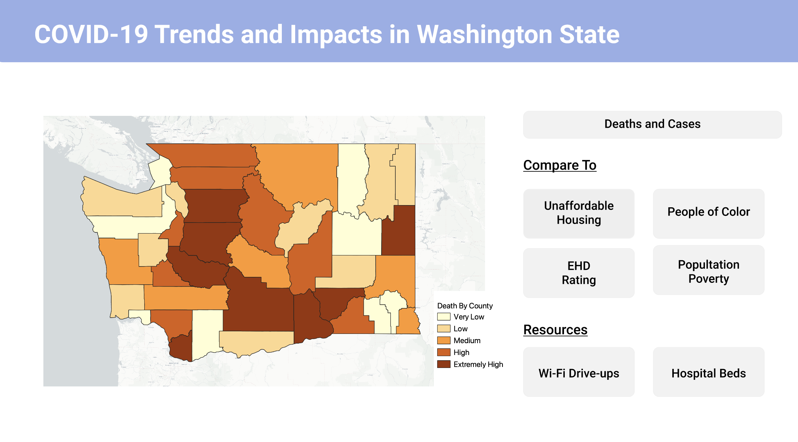
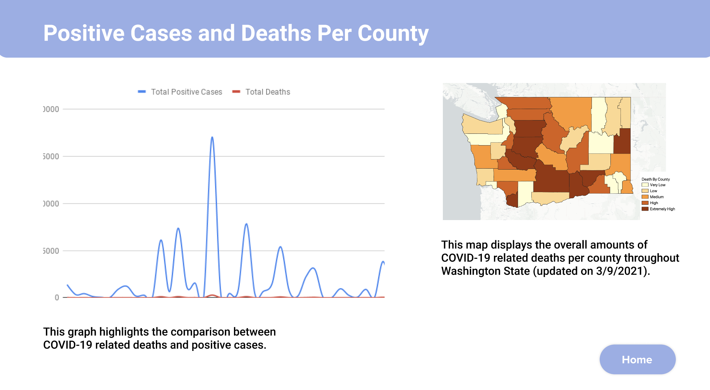
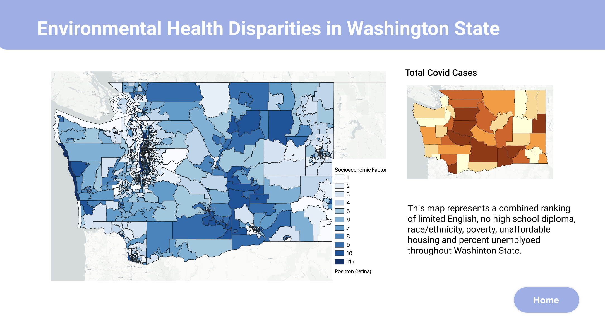
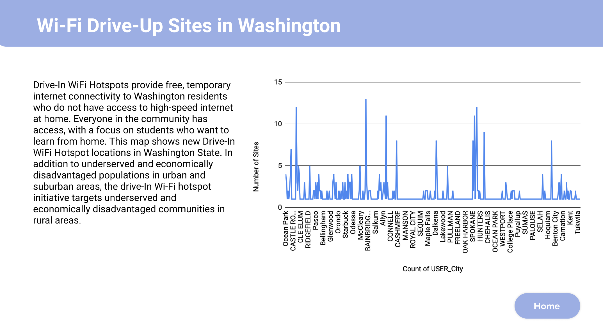
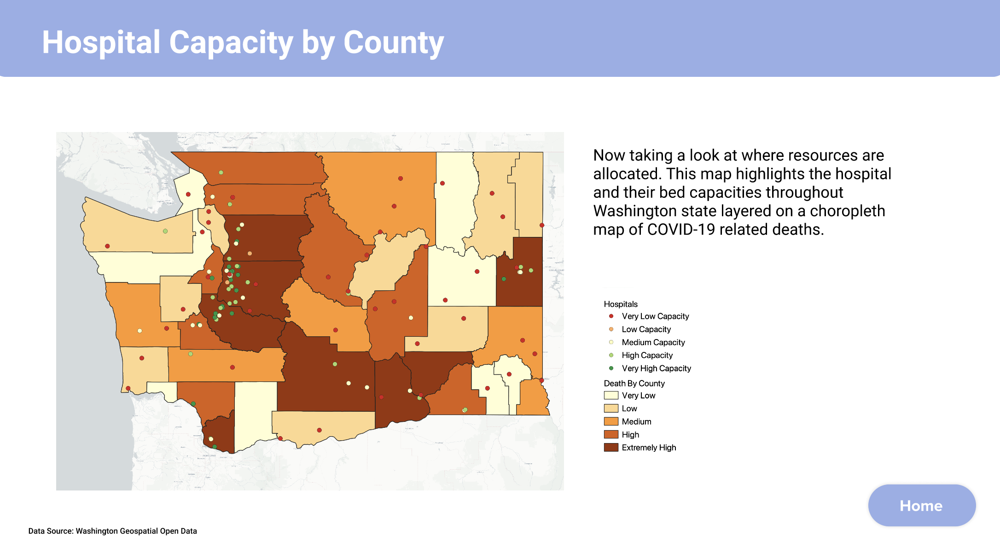

# COVID-19 Trends and Impacts in Washington State
#### GEOG 548 | Hershey Lande, Feben Alemu, Nicole Lorenzo, Emenetu H, Habtamu Kabeto

Access Full Datadashbaord [HERE](https://www.figma.com/file/0Vdz5wS3pe1kmTI0YW4oM5/458-Final-Project?node-id=0%3A1)
## Project Description
Evaluate and understand the factors that affect the general community and individual vulnerability to covid-19 through the use of a smartdashboard, analysis, and demographic in Washington state.

## Project Goal
The goal of this project is to identify and highlight the impacts and trends COVID-19 has created in the past year. We want to convey the correlation between high COVID-19 rates and poverty and accessibility fluctuate depending on which county you reside in. By understanding different demographics throughout Washington state, will provide insights as to which communities are being affected the most. Poverty, diversity, socioeconomic rating, and housing status are evaluated throughout the state. Throughout the dashboard created, we will be able to analyze where COVID-19 is creating the most impact, which communities are being affected, and where the relief resources are being implemented.

## Data and Findings

This map displays the overall amounts of COVID-19 related deaths per county throughout Washington State (updated on 3/9/2021). Majority of the high death areas are located within King County and areas south of King County. In mind that these areas contain growing cities and higher population densities compared to the rest of the state.

This graph highlights the comparison between COVID-19 related deaths and positive cases. Although the number of positive cases are constantly higher and differentiating, it’s important to note that there still is a correlation between the high number of positive cases and COVID-19 related deaths throughout all areas.

##### Poverty Levels:
Low-income populations are more susceptible to environmental risk factors and have higher rates of chronic diseases. Individuals who live in poverty endure persistent stress, which alters their biological susceptibility or extrinsic vulnerabilities. The data available in the ACS measured people living under 185% of the federal poverty level.

##### People of Color and Different Ethnicies:
POC communities have a deep history of being segregated and this in turn has impacted communities today. When comparing where the hot spots for POC communities are in and the hot spots for high COVID-death cases you can easily see the correlation and the locations of these hot spots are similar. It is important that we ensure that COVID relief resources are not only available to these communities but also accessible.

##### EHD Socioeconomic factors

This map represents a combined ranking of limited English, no high school diploma, race/ethnicity, poverty, unaffordable housing and percent unemployed throughout Washington State.

Low-income communities have higher rates of chronic diseases) and can be more vulnerable to environmental risk factors. Living in poverty creates chronic stress for individuals, modifying their biological susceptibility or extrinsic vulnerabilities. When faced with environmental risk factors, communities with more low-income households may also have lower resilience. The data for People of Color is derived from the OFM dataset. It is a sum of all race/ethnicity categories EXCEPT White/Non-Hispanic, this includes: Black, American Indian/Alaskan Native, Asian, Native Hawaiian-Other Pacific Islander, two or more races and the ethnicity grouping of "Spanish/Hispanic/Latino". Housing burden (both mortgage and rent) influence health in many ways, including financial stress and the unaffordability of basic necessities such as healthy food

##### Unaffordable Housing:
Housing burden (both mortgage and rent) influence health in many ways, including financial stress and the unaffordability of basic necessities such as healthy food or health care services. This map represents the percent households spend on housing costs. It uses ACS table DP04 Housing Characteristics. There are three categories under " Selected Monthly Costs as a percentage of household income" for households with mortgages, without mortgages and rentals. Percentages are presented for households spending greater than 30 percent of their income on housing costs. For example 1679 households use about 45% of their income on housing costs and 3405 households use about 40% of their income toward housing. Throughout this data and map we could see how unaffordable the state of Washington is becoming and the struggles of many households.

##### Wifi Drive Ups

Drive-In WiFi Hotspots provide free, temporary internet connectivity to Washington residents who do not have access to high-speed internet at home. Everyone in the community has access, with a focus on students who want to learn from home. This map shows new Drive-In WiFi Hotspot locations in Washington State. In addition to underserved and economically disadvantaged populations in urban and suburban areas, the drive-In Wi-Fi hotspot initiative targets underserved and economically disadvantaged communities in rural areas.

##### Hospital Capacities

Now taking a look at where resources are allocated. This map highlights the hospital and their bed capacities throughout Washington state layered on a choropleth map of COVID-19 related deaths. There is a cluster of high capacity hospitals in and around the King County area. These are the areas and communities that are being strongly affected by COVID-19. Possible correlations being that King County is home to a high population density and urban growth. It makes sense that there are clusters of resources around areas of high populations, but keep in mind that these are also the areas (predominantly King County and close surrounding areas), where more people are being negatively affected. It’s important to acknowledge that not everyone has the same accessibility to these resources. Possible reasons may be lack of health insurance, funds, or transportation. Moving forward, as a community effort it’s important to find ways to expand health resources to all communities.

## Moving Forward
Poverty places people under a lot of tension, which affects their biological vulnerability and extrinsic vulnerabilities. There are many people who face disparities on the daily due to poverty and when we also consider a global pandemic, COVID-19 affecting everyone globally, these disparities exemplify even more. Our society has a huge gap when talking about resources and opportunities, Covid-19 has impacted these resources for people especially those that live in poverty. Access to wifi is important to children and people who work in order to continue their education and work, the WiFi Drive-up sites is one important resource that started during this pandemic.

## Applied Libraries

## Acknowledgements
